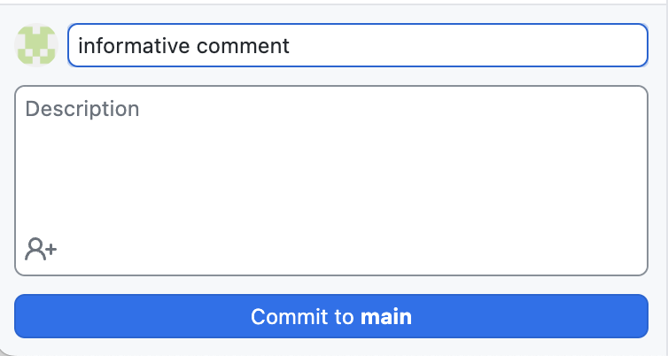

# course-notes

## Setup
### Quarto Set-Up

Begin by [installing Quarto](https://quarto.org/docs/get-started/).

Texts can be authored in Quarto using JupyterLab or classic Jupyter Notebook. To start a new document, open Jupyter and create a new notebook file. 

To set up the document, create a new Raw NBConvert cell. This will be used to set document-level YAML options. The Data 100 lecture notes are generated using the following YAML settings:

```
---
title: "Name of the Lecture"
execute:
    echo: true
format:
  html:
    code-fold: true
    code-tools: true
    toc: true
    toc-title: Name of the Lecture
    page-layout: full
    theme: [cosmo, cerulean]
    callout-icon: false
jupyter: python3
---
```

Now, the notebook is ready for writing content. Quarto supports all the functionality of a standard ipynb file – code cells, markdown, and LaTeX. To begin writing lecture notes, it's a good idea to first set out the main headings of the document. These typically correspond to the title slides of each lecture ([example](https://docs.google.com/presentation/d/1FZJhOS8S1lCqZCRxbyys9rCZT0QxdY4hcmvZDskEHFI/edit#slide=id.g1150ea2fb2b_0_220)) and are written with the Markdown second headng level (`##`). Quarto will auto-populate the table of contents as these headings are created.

To view the Quarto file, open a terminal window (either [within Jupyter](https://docs.google.com/presentation/d/1FZJhOS8S1lCqZCRxbyys9rCZT0QxdY4hcmvZDskEHFI/edit#slide=id.g1150ea2fb2b_0_220) or through your machine's terminal) and navigate to the notebook's directory. Running the command `quarto preview notebook.ipynb` will render the document and open it in a new web browser tab.

With the preview activated, the rendered view will update every time a change is saved in the notebook. When editing the document, it's helpful to have side-by-side views of the notebook and preview so you can watch changes in real-time.

### Cloning the Repo
After you've installed quarto, go into your terminal on your *local* device and type 

`git clone https://github.com/DS-100/course-notes.git`

If you're unable to clone the repo, please contact the head/infra TAs to make sure you have read/write access to this repository. 

### Environment Setup
This section will ensure that you have all the necessary packages to render the website. We recommend using Conda ([download here](https://www.anaconda.com/download)) to keep track of your environment. 

Run the following in your terminal within the main directory: 

```
conda create --name data100quarto 
conda activate data100quarto
pip3 install -r requirements.txt # will take a while
ipython kernel install --user
```

If you get an `error: externally-managed-environment` on the third line, run `pip3 install -r requirements.txt --break-system-packages`

Remember to always activate the right environment before running anything with `conda activate data100quarto`.


### Repo Organization 
This website uses Quarto to render pages and is organized based on the Quarto API. Here are some important files: 

* `index.md` is a markdown file that contains the text to be displayed on the landing page for the course notes website. You should update this text to reflect the current semester.
* `_quarto.yml` is a YAML file that specifies which notes should be visible to students. For Sp24, the entire Fa23 course notes ([repo](https://github.com/DS-100/fa23-course-notes), [website](https://ds100.org/fa23-course-notes/)) was made available to students at the start of the semester, and notes for Sp24 were updated a few hours before/after lecture to give course staff sufficient time to edit the note. To edit which notes are visible to students, 
  * Under `chapters`, comment out any note that should not be visible to students. `index.md` should always be visible. 
  * The `downloads` line specifies what downloadable export formats for the course notes should be allowed. While it’s possible to set this up such that Quarto creates a downloadable pdf of all notes, pdf conversion often errors because Quarto can only parse a limited amount of text into an output file. It’s recommended to leave this line commented out to avoid this issue. 
* Each subpage has it's own folder and `.qmd` (quarto) file. 


## Editing Notes
**Always `git pull` before making any new changes**. 

To edit a note, navigate to the directory for the corresponding lecture in your terminal. Most directories contain four items: 

* a folder for the `images` used in the note
* a folder for the `datasets` used in the note
* a folder generated by Quarto when rendering the note. This folder is hidden from github. 
* a `.qmd` (Quarto markdown) file containing the note text. 

Some directories may not contain every component (eg some lectures don’t use any dataset files).

Notes are edited by converting the `.qmd` file to an `.ipynb`. In your terminal, run `quarto convert path/to/note_name.qmd` to generate an editable `.ipynb` file (the `.qmd` files are also editable, but it is often harder to format things). This will create a Jupyter notebook named `note_name.ipynb`. Open the notebook to begin editing. 

Quarto converted notebooks work just like a typical Jupyter notebook. Markdown cells are used to write narrative text, while code cells are used to run example code. To preview how your changes will render, run `quarto preview path/to/note_name.ipynb` in your terminal. This will open the HTML output of the notebook in a new browser tab. The preview will update every time you save the notebook, so it’s often helpful to have this tab open side-by-side with the notebook.

### Document Formatting

A pdf view of how this notebook renders in Quarto can be found [here](https://drive.google.com/file/d/17ga5wvfcmvAzQ1rbnCP4kEf5bckST3--/view?usp=sharing).

#### Formatting Code

The `code-fold: true` option in the YAML set-up will automatically collapse all code cells in the rendered document. If a particular code cell should be uncollapsed by default (e.g. to explicitly show a `pandas` example), a cell-specific YAML option can be specified:

```
#| code-fold: false
print("this code is now visible")
```

#### Formatting Images

Inserting images in a Quarto document is similar to the standard Markdown syntax. The difference is that Quarto will insert figure captions automatically. The syntax below will insert an image with an accompanying description.

```
#
```

#### Formatting Learning Outcomes

Each lecture note should start with a brief list of intended student learning outcomes. These are formatted as collapsable call-out cells, which can be created in a Markdown cell using the syntax below.

```
::: {.callout-note collapse="true"}
## Learning Outcomes
* Gain familiarity with Quarto
* Create your first Quarto document
* Write A+ Data 100 lecture notes
:::
```

### Previewing Note
To see how your ipynb renders as an HTML file, run `quarto preview path/to/note_name.ipynb`. This will open a website view of your note in the browser. 

Once you're satisfied with your changes, **revert the `.ipynb` file to a `.qmd`** by running `quarto convert path/to/note_name.ipynb`. Then, **delete the `.ipynb` and `.html` files** so that only the `.qmd` file remains in the folder. From here, push your changes to github.

### Rendering Changes
These steps should only be taken when the note is finalized. When a note is in the development stage, just push the changes to the `.qmd` file and do not render the note. 

Navigate to the main folder and run `conda activate data100quarto`. 

To render the whole website, run `quarto render`. This process might take a while if you have many notes. **Check that the `docs/search.json` file exists**. In the Fa23 and Sp24 semesters, running `quarto render` would delete this file, making it so that students cannot search the textbook. If this happens, run `quarto preview` and individually click into each course note to populate the `search.json` file.

If you only made *edits* to one note, you can skip the (sometimes long) process of rendering the whole website and just do the following: 
`quarto render path/to/note.qmd`


## Pushing to Github
Once you're satisfied and *thoroughly tested* your changes, you can push your edits onto Github. There are two ways to do this: 

1. **Command Line**. Navigate to the main `course-notes` folder if you haven't already and make sure you're in the right environment. 

```
git add . # this makes sure git tracks any new files created
git commit -m <your message here> # please commit with an informative message
git push # push your changes to github
```

2. **Github Desktop** ([download](https://desktop.github.com/)). This is the GUI version of the command line. 

  * Choose the files you want to commit on the left hand menu. By default, github will select all changes/new files. 
  * Write an informative comment on the bottom left hand corner and click "commit to main" once finished 
  * Push your changes using the button on the top right. 


## Summary of Quarto workflow:
Editing a note: 
1. Convert the `.qmd` file to an `.ipynb`: `quarto convert path/to/note.qmd`
2. Make edits on the `.ipynb` file
3. Preview notebook: `quarto preview path/to/note.ipynb`
4. Convert to `.qmd` for rendering: `quarto convert note_name.ipynb` (must cancel `quarto preview` first)
5. Delete the `path/to/note.ipynb` and `path/to/note.html` 

Rendering a Note: 
1. Update `_quarto.yml` with the new note to be added
2. Render HTML docs: `quarto render` (must cancel quarto preview first)
  * check that the `search.json` file was generated. If not, `quarto preview` and click into every note.


# Data 100-specific items

General commands/notes:
  * `jupyter lab # local jupyter setup`
  * `ipynb` -> `qmd`: `quarto convert notebook.ipynb` or `quarto convert notebook.qmd`
  * `quarto render`: renders HTML to `docs`. Note `qmd` has to exist for rendering
  * Edit `_quarto.yml` to include note in sidebar/table of contents
* Quick local development:
  * TODO: how to quickly render just one notes directory and not all notes?
* Publish notes to GitHub pages:
  * `quarto render` everything
  * `git add`, `git commit`, `git push`
  * Can view website compilation on GitHub (look for yellow-to-green button next to commit number)
* Common errors:
  * `Illegal instruction: 4 ...` close jupyter lab

## Other Quarto Resources

[Quick Start Guide](https://quarto.org/docs/get-started/)

[Comprehensive Guide](https://quarto.org/docs/guide/)

[Markdown in Quarto](https://quarto.org/docs/authoring/markdown-basics.html)
